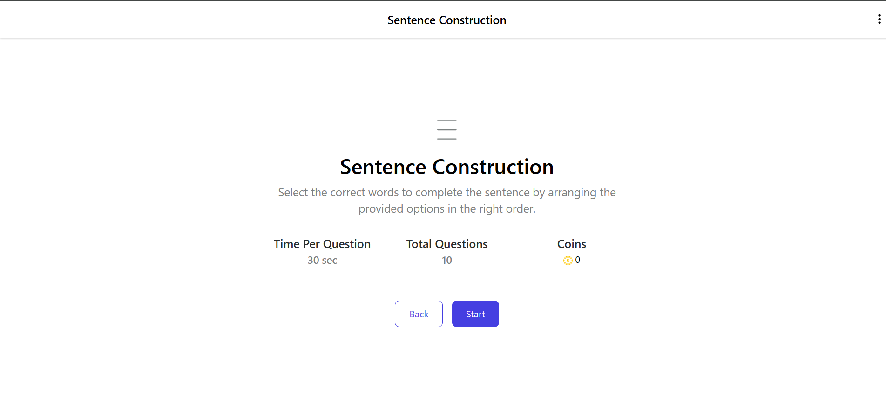
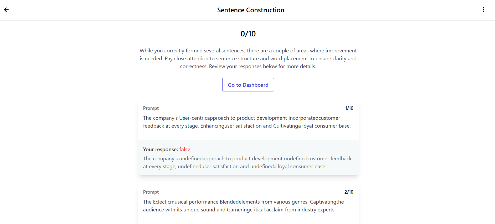

# 📘 Sentence Construction App

An interactive web application to help users practice sentence construction using shuffled words. Built using **React**, **Recoil**, **Vite**, and **Tailwind CSS**.

---

## 🚀 Features

- Shuffled word display
- Interactive sentence builder
- Sentence correctness checker
- Clean UI with responsive design
- State management using Recoil

---

## 🛠️ Tech Stack

- **React.js** – Frontend library
- **Recoil** – State management
- **Vite** – Fast build tool
- **Tailwind CSS** – Utility-first CSS framework
- **React Icons** – Icons library

---

# Result
This is main page


This is question page


This is Result page



## 📦 Installation

```bash
git clone https://github.com/your-username/sentence-construction-app.git
cd sentence construction
npm install
npm run dev


---


# image section


